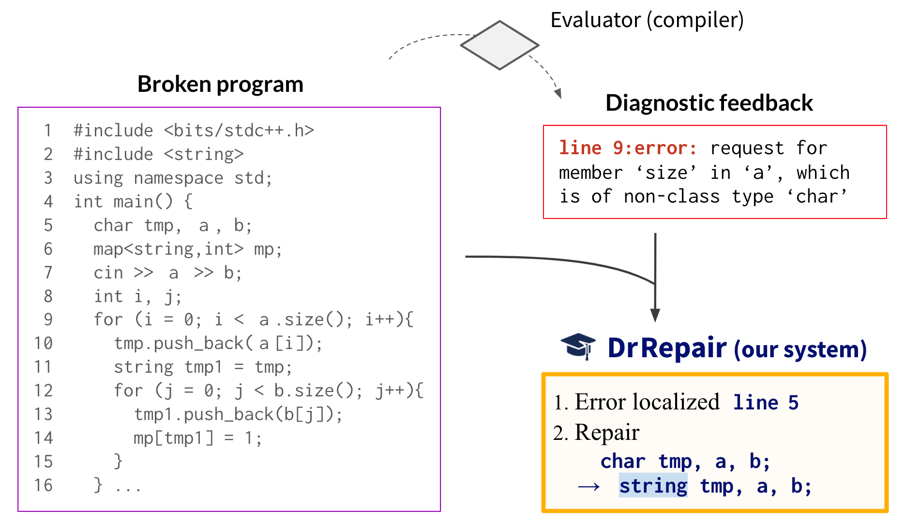

# DrRepair: Learning to Repair Programs from Error Messages

This repo provides the source code & data of our paper: [Graph-based, Self-Supervised Program Repair from Diagnostic Feedback](https://arxiv.org/abs/2005.10636) (ICML 2020).
<!-- [[Paper (ICML2020)](https://arxiv.org/abs/2005.10636)] -->
```
@InProceedings{Yasunaga20DrRepair,
  author =  {Michihiro Yasunaga and Percy Liang},
  title =   {Graph-based, Self-Supervised Program Repair from Diagnostic Feedback},
  year =    {2020},  
  booktitle =   {International Conference on Machine Learning (ICML)},  
}
```
<p align="center">
  
</p>

## Dependencies
* GCC: Follow the SPoC requirement (https://github.com/Sumith1896/spoc)
* Python 3.6.8 (e.g. `conda create -n DrRepair python=3.6.8`)
* Python libraries
  - torch==1.0.1, numpy, tqdm, regex, joblib, pyyaml, bottle, cheroot, tensorboardX
  - clang==8.0.1 (do the following)
      ```
      conda config --add channels conda-forge
      conda install python-clang==8.0.1
      ```

## Data
Download all the raw data -- DeepFix, SPoC, codeforce (for pretraining) -- by
```
./download_raw_data.sh
```

You can preprocess the raw data to get the **program repair** data by running the commands in
```
data/1.run-gen-err-dataset--orig-spoc.sh
data/2.run-gen-err-dataset--auto-corrupt--spoc.sh
data/3.run-gen-err-dataset--auto-corrupt--deepfix.sh
```
However, this takes a significant time, so for your convenience, you can download all the preprocessed data by
```
./download_preprocessed_data.sh
```


The repo structure looks like the following:
```plain
.
└─ raw_data/
   ├── codeforce_data/                  (raw programs from codeforce)
   ├── deepfix_data/                    (raw programs from deepfix)
   └── spoc_data/
       ├── spoc                              (SPoC data release)
       └── translation_preds                 (line-level code predictions from Kulal+19)

└─ data/                             
   ├── *.sh, *.py                       (preprocessing scripts)
   ├── err-data-compiler--orig-spoc/    (preprocessed, program repair data for spoc)
   ├── err-dev-compiler--for-SPoC/      (└─ dev data for spoc)
   ├── err-vocab-compiler--for-SPoC/    (└─ vocab for spoc)
   ...
   ... [similarly for deepfix and pre-training]

└─ utils/                      (utilities for code processing)

└─ model/                      (DrRepair model)

└─ evaluation/                 (to evaluate Repair model on deepfix/spoc test)
   ├── deepfix
   └── spoc
       ├── translation_preds_test/           (line-level code predictions from Kulal+19 for TestP/TestW)
       ...
```


## Train models
Let's train program repair models.
First, go to `model` directory.
Then, run commands listed in `run_deepfix.sh` or `run_spoc.sh`.
For example, if we train DrRepair ("base + graph" in the paper) on the DeepFix data, run:
```
name="code-compiler--2l-graph"
mkdir -p out_deepfix/${name}
python3 -u main_deepfix.py -o ${name} train \
    configs/base.yml  configs/data-deepfix/err-data-orig.yml \
    configs/model-code-compiler/2l-graph--dec-attn-all.yml
```


## Evaluate models
We run the trained program repair model as a server.
We then call this model on application tasks (DeepFix and SPoC) to evaluate the usefulness of the model.

### DeepFix
#### 1. Start server
First, go to `model` directory.
We run a trained model (e.g. code-compiler--2l-graph) as a server by
```
name="SERVER--code-compiler--2l-graph"
mkdir out_deepfix/${name}
python3 -u main_deepfix.py -o ${name} server -p <port> \
    -l out_deepfix/code-compiler--2l-graph/<checkpoint> \
    configs/base.yml  configs/data-deepfix/err-data-orig.yml \
    configs/model-code-compiler/2l-graph--dec-attn-all.yml
```
For `<port>`, pick a port number (e.g. 8080) for the server.
For `<checkpoint>`, pick a checkpoint (e.g. 150000) of the trained model.
Then run ```ifconfig``` to get the IP address (e.g. 172.24.67.161) of the machine hosting this model.
Concrete examples are provided in the second half of `model/run_deepfix.sh`.

#### 2. Run model on DeepFix test
Go to `evaluation/deepfix` directory. First prepare:
```
repo_root="../../../.."
program_data_root=${repo_root}"/raw_data/deepfix_data"
test_split_root=${repo_root}"/data/err-data-compiler--auto-corrupt--orig-deepfix/bin4"
```
To run the trained model on the DeepFix test examples, do
```
name="code-compiler--2l-graph"
mkdir -p out/${name}/log
cd out/${name}

for entry in ${test_split_root}/*
do
  probid=`basename $entry`
  python3 -u ../../test_deepfix.py \
  --input-code-dir ${program_data_root}/${probid}/erroneous \
  --repairer-server  http://<IP>:<port>/pred
done
```
where you plug the IP address and port number into `<IP>` and `<port>`.
After this completes, you can get the test accuracy by
```
python3 -u ../../collate_deepfix.py
```
Concrete examples are provided in `evaluation/run_test_deepfix.sh`.


### SPoC
#### 1. Start server
First, go to `model` directory.
We run a trained model (e.g. code-compiler--2l-graph--finetune) as a server by
```
name="SERVER--code-compiler--2l-graph--finetune"
mkdir out_spoc/${name}
python3 -u main_spoc.py -o ${name} server -p <port> \
    -l out_spoc/code-compiler--2l-graph--finetune/<checkpoint> \
    configs/base.yml  configs/data-spoc/err-data-orig.yml \
    configs/model-code-compiler/2l-graph--dec-attn-all.yml
```
Similar to DeepFix, pick a port number and a checkpoint, and get the IP address.
Concrete examples are provided in the second half of `model/run_spoc.sh`.

#### 2. Run model on SPoC test
Go to `evaluation/spoc` directory. First prepare:
```
repo_root="../../../.."
```
To run the trained model on all the programs in SPoC TestW, do
```
name="code-compiler--2l-graph--finetune"

INPUT=translation_preds_test/testw    #change to testp if you want to evaluate on testp
N=$(tail -n+2 ${INPUT}.tsv | cut -f 3-6 | uniq | wc -l)  # Count the number of programs
interval=10

mkdir -p out_testw/${name}/log        #change to testp if you want to evaluate on testp
cd out_testw/${name}                  #change to testp if you want to evaluate on testp

i=1
while [[ $i -le $N ]]; do
  python -u ../../test_spoc.py -p 100 \
  --compile-budget 100 --n-parallel ${interval} \
  --repairer-server  http://<IP>:<port>/pred \
  ../../${INPUT} $i
  i=$(($i + ${interval}))
done
```
where you plug the IP address and port number into `<IP>` and `<port>`.
After this completes, you can get the test accuracy by
```
python3 -u ../../collate_spoc.py
```
Concrete examples are provided in `evaluation/run_test_spoc.sh`.


## Acknowledgment
The original DeepFix and SPoC data used in this work come from the following papers:
```
DeepFix: Fixing common C language errors by deep learning. Rahul Gupta, Soham Pal, Aditya Kanade, Shirish Shevade. AAAI 2017.
SPoC: Search-based Pseudocode to Code. Sumith Kulal, Panupong Pasupat, Kartik Chandra, Mina Lee, Oded Padon, Alex Aiken and Percy Liang. NeurIPS 2019.
```
